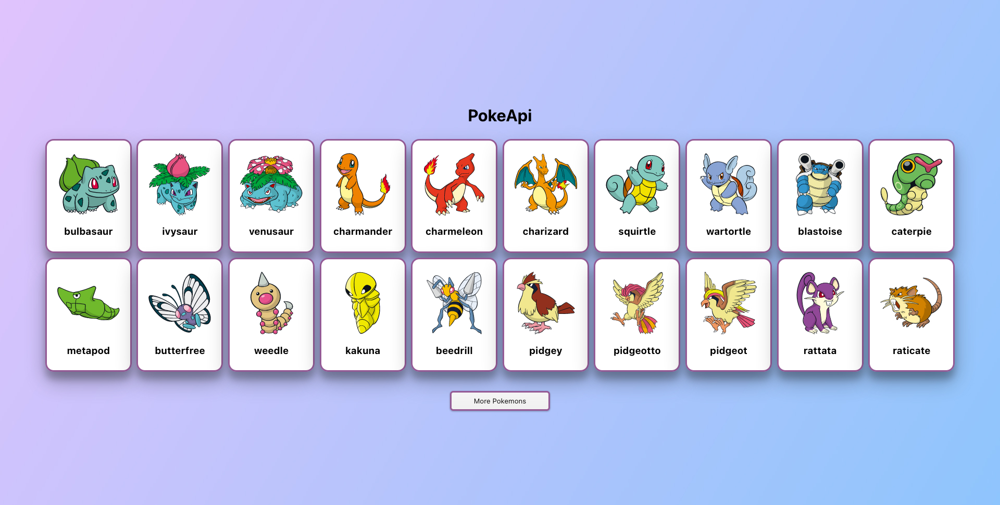

# PokeApi 👾

JavaScript application that shows a list of pokemons. \
I used React as framework. \
Data pulled from: [This endPoint](https://pokeapi.co/api/v2/pokemon)

## Project Setup 📌

```
git clone https://github.com/SolTuripe/another-pokeapi.git
cd another-pokeapi
npm install
```

## In the project directory, you can run: ✔

### `npm start`

Runs the app in the development mode.\
Open [http://localhost:3000](http://localhost:3000) to view it in your browser.

The page will reload when you make changes.\
You may also see any lint errors in the console.

### `npm test`

Launches the test runner in the interactive watch mode.\
See the section about [running tests](https://facebook.github.io/create-react-app/docs/running-tests) for more information.

## Page View 📷

<p align="center">

</p>

## Learn More 📚

You can learn more in the [Create React App documentation](https://facebook.github.io/create-react-app/docs/getting-started).

To learn React, check out the [React documentation](https://reactjs.org/).
